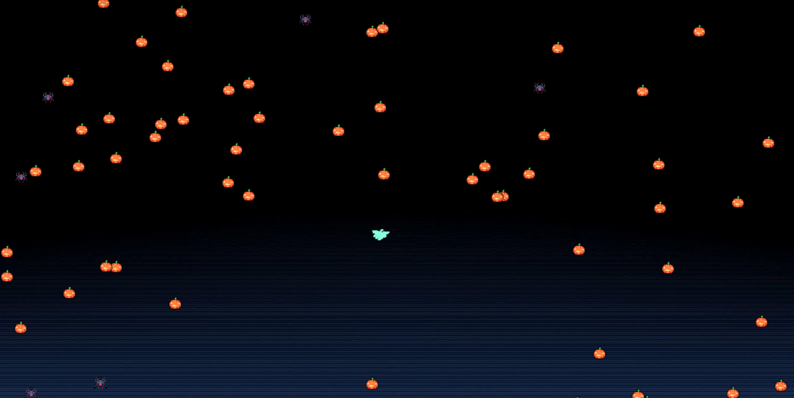

# Point

[](https://www.python.org/)
[](https://www.pygame.org/)
[](https://isocpp.org/)
[](LICENSE)

**Point** is a 2D physics-based arcade game where players control a floating Ghost character (`Me`) navigating across level space. By latching a grappling rope onto nearby pumpkins (friends) or spiders (enemies), players swing with pendulum momentum to collect pumpkins for score, avoid deadly spiders, and escape rising lava.

The repository includes both a complete **Python (Pygame)** implementation and the original **C++ (SDL2)** codebase.

---

## Table of Contents

- [Key Features](#key-features)
- [Gameplay Preview](#gameplay-preview)
- [Technology Stack](#technology-stack)
- [System Requirements & Prerequisites](#system-requirements--prerequisites)
- [Quick Start & Installation](#quick-start--installation)
  - [Python Version (Recommended)](#python-version-recommended)
  - [C++ Version](#c-version)
- [Game Controls & Rules](#game-controls--rules)
- [Project Structure](#project-structure)
- [Architecture & Mechanics](#architecture--mechanics)
- [Testing & Quality Assurance](#testing--quality-assurance)
- [Packaging & Distribution](#packaging--distribution)
- [Troubleshooting](#troubleshooting)
- [Security Considerations](#security-considerations)
- [License & Attribution](#license--attribution)

---

## Key Features

- **Pendulum Physics**: Dynamic rope swinging calculated via real-time trigonometric angular velocity and gravity vectors (`GRAVITY = 0.4`).
- **Hazard System**: Deadly spiders (`Spider2.png`) and rising multi-layer gradient lava (`Lava`).
- **Scoring & Leaderboard**: Collect pumpkins (+100 pts) and track persistent high scores across play sessions via `ScoreBoard.txt`.
- **Custom Audio & Fonts**: Atmospheric background music (`happy_fun_bg.mp3`), sound effects (`eat_point.wav`, `dead.wav`), and custom font rendering (`font/halloween.otf`).
- **Dual Implementations**: Runnable as a modern Python/Pygame package or standard C++/SDL2 project.

---

## Gameplay Preview



---

## Technology Stack

| Domain | Python Stack | C++ Stack (Original) |
| :--- | :--- | :--- |
| **Language** | Python 3.8+ | C++11 |
| **Graphics & Windowing** | Pygame 2.6.1 | SDL2, SDL2_image |
| **Audio Engine** | Pygame Mixer | SDL2_mixer |
| **Text & Font Rendering** | Pygame TTF Font | SDL2_ttf |
| **Build & Tooling** | `setuptools`, `pyinstaller` | Code::Blocks (`point.cbp`), GCC/G++ |
| **Testing** | `pytest` | Custom smoke tests |

---

## System Requirements & Prerequisites

### For Python
- **Python**: 3.8 or higher
- **Pip**: Latest package manager

### For C++
- **GCC / G++ Compiler**: MinGW-w64 (Windows) or Clang/GCC (macOS/Linux)
- **SDL2 Development Libraries**: `SDL2`, `SDL2_image`, `SDL2_ttf`, `SDL2_mixer`

---

## Quick Start & Installation

### Python Version (Recommended)

#### 1. Clone the Repository
```bash
git clone https://github.com/hoang2306/Point.git
cd Point
```

#### 2. Set Up Virtual Environment

##### Windows (PowerShell)
```powershell
python -m venv venv
.\venv\Scripts\Activate.ps1
```

##### macOS / Linux
```bash
python3 -m venv venv
source venv/bin/activate
```

#### 3. Install Dependencies
```bash
pip install -r requirements.txt
```

#### 4. Run the Game
```bash
python -m py_point.main
```
*Or directly:*
```bash
python py_point/main.py
```

---

### C++ Version

#### Option A: Building with Code::Blocks
1. Open [`point.cbp`](./point.cbp) in Code::Blocks.
2. Ensure SDL2 search paths (`include` and `lib`) are configured for GCC.
3. Select **Build and Run** (F9).

#### Option B: Building via Command Line (g++)

##### Windows (MinGW with SDL2)
```powershell
g++ -O2 main.cpp LTexture.cpp Me.cpp Object.cpp ObjectManager.cpp RenderWindow.cpp Rope.cpp `
  -I. -Iheader -lmingw32 -lSDL2main -lSDL2 -lSDL2_image -lSDL2_ttf -lSDL2_mixer `
  -o bin/Release/point.exe
.\bin\Release\point.exe
```

##### Linux / macOS
```bash
g++ -O2 main.cpp LTexture.cpp Me.cpp Object.cpp ObjectManager.cpp RenderWindow.cpp Rope.cpp \
  -I. -Iheader -lSDL2 -lSDL2_image -lSDL2_ttf -lSDL2_mixer \
  -o bin/Release/point
./bin/Release/point
```

---

## Game Controls & Rules

| Input Action | Result |
| :--- | :--- |
| **Left Mouse Click & Hold** | Grapple rope to the nearest pumpkin or spider to swing |
| **Left Mouse Release** | Release rope to fly forward with conserved momentum |
| **Main Menu -> PLAY** | Start new game session |
| **Main Menu / End Menu -> EXIT** | Exit game application |
| **End Menu -> RETRY** | Restart after game over |

### Rules
1. **Eating Pumpkins**: Collecting pumpkins (`Gold_1.png`) grants **+100 score** and removes the item.
2. **Defeating Hazards**: Colliding with spiders (`Spider2.png`) or falling into the rising lava triggers Game Over (`lmao ded`).
3. **Leaderboard**: High scores persist locally in `ScoreBoard.txt` and display Top 3 scores on the End Menu LeaderBoard.

---

## Project Structure

```
Point/
├── py_point/                 # Python Pygame Implementation
│   ├── __init__.py           # Package initializer
│   ├── main.py               # Application entry point, game loop, and audio setup
│   ├── vector.py             # 2D vector algebra (Vector & VectorAlgebra)
│   ├── object.py             # Entity structs (Vec2, Vel2, Acc2, Object)
│   ├── me.py                 # Hero player class (Me), collision & score hits
│   ├── lava.py               # Rising lava hazard entity (Lava)
│   ├── rope.py               # Pendulum rope physics & target selection (Rope)
│   ├── object_manager.py     # Level generation & chunk spawner (ObjectManager)
│   ├── event_manager.py      # UI mouse hit-testing & rope engagement
│   ├── ltexture.py           # Font texture renderer (LTexture)
│   └── render_window.py      # Pygame window manager & screen renderers
├── header/                   # C++ Header Files
│   ├── EventManager.hpp
│   ├── LTexture.hpp
│   ├── Lava.hpp
│   ├── Me.hpp
│   ├── Object.hpp
│   ├── ObjectManager.hpp
│   ├── RenderWindow.h
│   ├── Rope.hpp
│   └── Vector.hpp
├── tests/                    # Automated Unit Tests
│   ├── test_collision.py     # Collision logic unit tests
│   ├── test_event_mgr.py     # UI click testing unit tests
│   ├── test_physics.py       # Entity movement & rope physics tests
│   ├── test_scoreboard.py    # Score I/O unit tests
│   └── test_vector.py        # Vector algebra unit tests
├── font/                     # Custom OTF Font Assets
│   └── halloween.otf
├── sound/                    # WAV and MP3 Audio Assets
│   ├── dead.wav
│   ├── eat_point.wav
│   ├── flying.wav
│   └── happy_fun_bg.mp3
├── texture/                  # PNG and JPG Image Sprites
│   ├── 1.png
│   ├── BLACK.jpg
│   ├── Ghost1.png
│   ├── Gold_1.png
│   ├── Pumpkin4.png
│   └── Spider2.png
├── preview/                  # Screenshot Assets
│   └── game.png
├── ScoreBoard.txt            # Local score persistence file
├── point.cbp                 # Code::Blocks C++ project file
├── pyproject.toml            # Python package manifest
├── requirements.txt          # Python dependencies
├── README_PYTHON.md          # Python specific documentation
└── README.md                 # Primary project documentation
```

---

## Architecture & Mechanics

### Pendulum Physics Model
When roped to a target object:
1. `Rope.set_target()` identifies the nearest object to the cursor position using squared Euclidean distance:
   $$\text{distance}^2 = (x_{\text{mouse}} - x_{\text{obj}})^2 + (y_{\text{mouse}} - y_{\text{obj}})^2$$
2. `Rope.rope_calculus()` calculates current angular orientation, swing quadrant, and net tangential speed ($V_{\text{net}}$):
   $$V_{\text{net}} = \sqrt{V_0^2 - 2 \cdot g \cdot \Delta y}$$
3. Velocity vector decomposition updates enemy, friend, and lava relative positions smoothly to simulate player swing motion.

### Persistence Format (`ScoreBoard.txt`)
Scores are stored as line-separated integers. Upon game over, scores are read into a sorted set, updated with the session score, saved atomically, and displayed in descending order on the LeaderBoard.

---

## Testing & Quality Assurance

Run the automated Python test suite using `pytest`:

```bash
python -m pytest -v
```

### Code Formatting & Linting

```bash
pip install black flake8
black --check py_point tests
flake8 py_point tests
```

---

## Packaging & Distribution

Bundle the Python application into a standalone executable using **PyInstaller**:

### Windows (PowerShell)
```powershell
pyinstaller --noconfirm --onedir --windowed `
  --add-data "texture;texture" `
  --add-data "sound;sound" `
  --add-data "font;font" `
  --add-data "ScoreBoard.txt;." `
  py_point/main.py
```

### macOS / Linux
```bash
pyinstaller --noconfirm --onedir --windowed \
  --add-data "texture:texture" \
  --add-data "sound:sound" \
  --add-data "font:font" \
  --add-data "ScoreBoard.txt:." \
  py_point/main.py
```
Output binaries are generated in the `dist/` directory.

---

## Troubleshooting

- **Audio Device Error**: If no audio output device is detected, the game logs a message and safely runs in silent mode without crashing.
- **Font Fallback**: If `font/halloween.otf` is inaccessible, font rendering automatically falls back to standard system fonts.
- **Asset Paths**: Asset loading uses `resolve_path()` to ensure correct relative resolution regardless of your execution directory.

---

## Security Considerations

- **Score Parsing**: `read_scores()` validates integer tokens safely and ignores corrupted lines in `ScoreBoard.txt`.
- **Sanitized I/O**: File operations use explicit encoding (`utf-8`) and relative path resolution without executing unsafe code or shell commands.

---

## License & Attribution

- **Original C++ Game Author**: Pham Duc Hoang (Student ID: 22021200), Advanced Programming Course, UET (QH-2022).
- **Contact**: `hoang123223@gmail.com`
- **License**: Provided as open-source for educational and project purposes. See original course citations in [README.md](file:///e:/vibe_project/Point/README.md).
